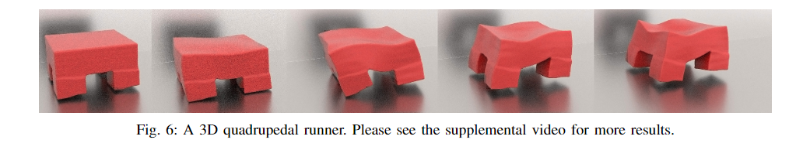

#### Paper-Prepare

* CV: CVPR,ICCV,ECCV
* Robtcis: IROS,ICRA
* IR: SIGIR
* NLP: ACL,EMNLP,COLING,CCL
* Graphics:SIGGRAPH(ASIA),SIGGRAPH,TOG,VIS
* Data minning && DataBase:KDD,ICDE,TKDE,VLDB,SIGMOD
* Prallel System:TC,ICDS,TPDS
* NetWork: SIGCOMM
* Target: 7

